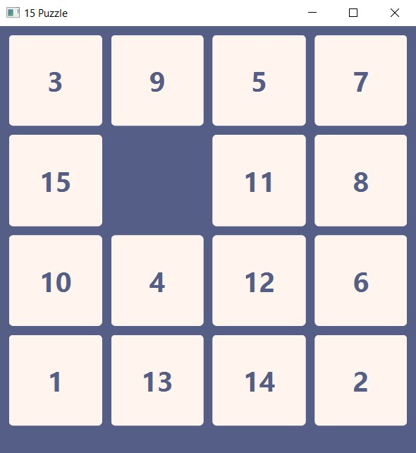
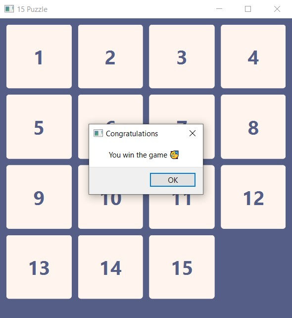

# 15 Puzzle 🧩

This game is designed using [Qt](https://doc.qt.io/qtforpython/) library in python.

The 15 puzzle is a sliding puzzle having 15 square tiles numbered 1–15 in a frame that is 4 tile positions high and 4 positions wide (for a total of 16 positions), leaving one unoccupied position.

Click on any cell, if it is adjacent to the empty space, it will move, otherwise nothing will happen. You have to arrange 15 squares in order to win.

---
## Game Environment





---
## Usage 🎮

First install requirement package:
```
pip install PySide6
```
Then you can run this program:
```
python main.py
```
**NOTE :** Please put the file with extension ui in the same path as main.py.