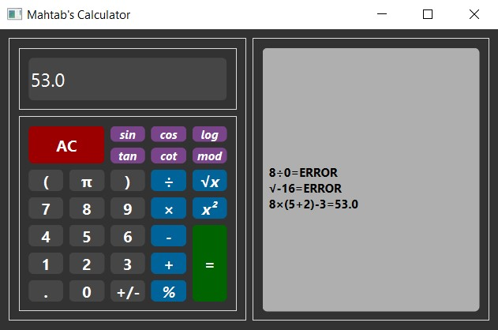

# Calculator

This calculator is designed using [pyside6](https://doc.qt.io/qtforpython/) library. In this version of the calculator, there are features such as power, square root, some trigonometric functions, logarithm base 10 and mod.

---

## How do I use this app?

First install requirement package:
```
pip install pyside6
```

Then you can run this program:
```
python main.py
```

