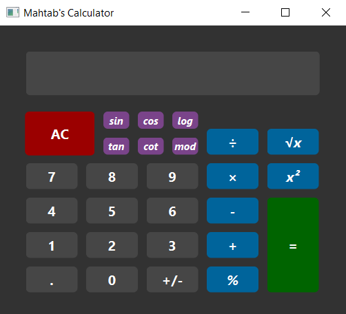

# Calculator

This calculator is designed using [pyside6](https://doc.qt.io/qtforpython/) library. By using this calculator, you can have the following features:
- sin
- cos
- tan
- cot
- log
- mod
- power
- square root

---

## How do I use this app?

First install requirement package:
```
pip install pyside6

```
Then you can run this program:
```
python main.py
```

**NOTE :** For using sin, cos, tan, cot, log and square root buttons, first enter the number, then press the operator button and equal button.

