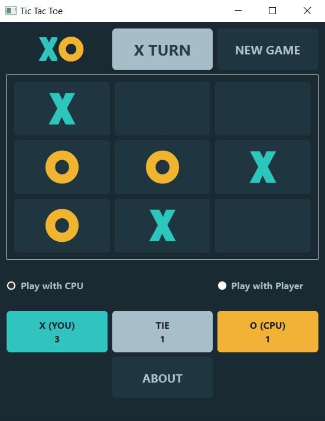
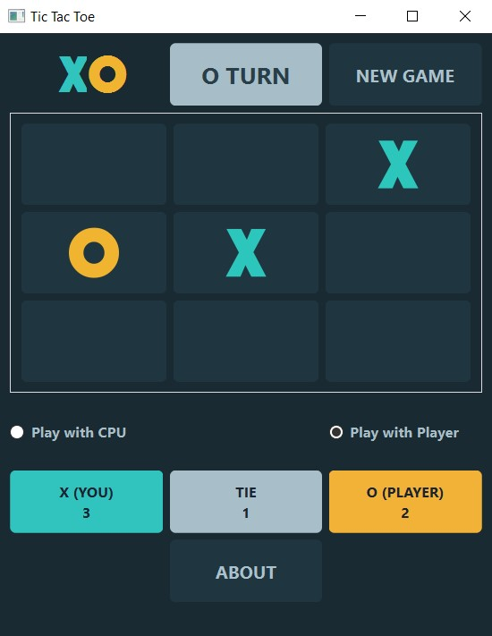

# ❌ Tic Tac Toe ⭕

This game is designed using [Qt](https://doc.qt.io/qtforpython/) library in python.

Tic Tac Toe is a simple game for two players. The first player who can quickly fill a row or a column or diagonally a 3 x 3 square wins the game. If all the cells of the table are filled and no one succeeds in completing the mentioned conditions, the game will be tied.

---
## Game Environment 

Click on the cell with your mouse to play. You can only place your pieces in the cells that are empty.

This game has two modes :
- ### Play with CPU


- ### Play with player


---
## Usage 🎮

First install requirement package:
```
pip install PySide6
```
Then you can run this program:
```
python main.py
```
**NOTE :** Please put the file with extension ui in the same path as main.py.